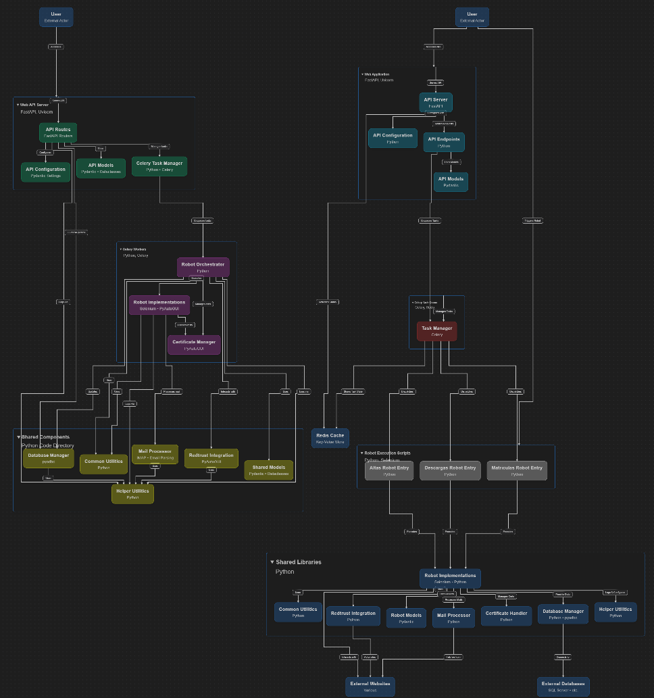

# RedTrust Automation

<div align="center">

<br />

 
 
 
 


<br />


<br />

</div>
## Introducción

**RedTrust Automation** es una plataforma robusta diseñada para automatizar procesos empresariales complejos relacionados con registros, descargas y gestión de puntos de vehículos. Aprovecha FastAPI para su API web, Celery y Redis para el procesamiento escalable de tareas asíncronas, y componentes modulares de robots para la automatización de procesos. RedTrust Automation permite una integración fluida, gestión eficiente de tareas y ejecución confiable de flujos de trabajo robóticos. Este documento proporciona una visión general de la arquitectura de la aplicación, detallando la interacción entre su API, la cola de tareas, los módulos de robots y la infraestructura de soporte.

### Resumen de la Arquitectura de la Aplicación

Este documento describe la arquitectura de la aplicación, centrándose en la interacción entre la API basada en FastAPI, Celery/Redis para la gestión de tareas y los módulos principales de robots: `robot_altas`, `robot_descargas` y `robot_matriculas_y_puntos`.

La aplicación está estructurada para proporcionar una interfaz web que permite disparar tareas automatizadas (robots) y gestionar su ejecución de forma asíncrona.

## Arquitectura de Alto Nivel

El sistema consta de tres componentes lógicos principales:

1.  **Capa API (FastAPI):** Expone endpoints para que los usuarios interactúen con el sistema, principalmente para lanzar tareas de robots. Actúa como punto de entrada para todas las solicitudes externas.
2.  **Cola de Tareas (Celery/Redis):** Gestiona la ejecución asíncrona de tareas de robots. FastAPI encola tareas en Redis y los workers de Celery las procesan.
3.  **Módulos de Robots:** Son los componentes principales de automatización responsables de tareas específicas (por ejemplo, `robot_altas`, `robot_descargas`, `robot_matriculas_y_puntos`).

<!-- Diagrama de Arquitectura -->
<div align="center">
    
</div>

## Desglose Detallado de Componentes

### 1. Capa API (FastAPI)

El directorio `app/api` contiene la aplicación FastAPI. Es responsable de:

*   Recibir solicitudes entrantes de los usuarios.
*   Validar los datos de las solicitudes.
*   Encolar tareas de robots en Celery.
*   Proporcionar actualizaciones de estado sobre tareas en curso.

**Componentes Clave:**

*   **`app/api/server.py`**: Instancia principal de la aplicación FastAPI.
*   **`app/api/routes/`**: Contiene las definiciones de rutas para las distintas funcionalidades de robots.
    *   **`app/api/routes/altas.py`**: Gestiona solicitudes relacionadas con el módulo `robot_altas`.
    *   **`app/api/routes/descargas.py`**: Gestiona solicitudes relacionadas con el módulo `robot_descargas`.
    *   **`app/api/routes/matriculas.py`**: Gestiona solicitudes relacionadas con el módulo `robot_matriculas_y_puntos`.
    *   **`app/api/routes/status.py`**: Proporciona endpoints para consultar el estado de tareas encoladas.
    *   **`app/api/routes/websocket_backend.py`**: Probablemente gestiona actualizaciones en tiempo real para el dashboard.
*   **`app/api/celery.py`**: Configura e inicializa la aplicación Celery, conectándola al broker Redis.
*   **`app/api/models/`**: Define modelos Pydantic para datos de solicitud y respuesta.
    *   **`app/api/models/task.py`**: Probablemente define la estructura de un objeto tarea.
*   **`app/api/config/api_config.py`**: Configuración de la API.

### 2. Cola de Tareas (Celery/Redis)

Celery se utiliza para el procesamiento asíncrono de tareas, con Redis como broker de mensajes. Esta configuración permite que la API responda rápidamente a las solicitudes de los usuarios sin esperar a que finalicen las tareas de robots de larga duración.

*   **Redis**: Almacena las tareas a procesar por los workers de Celery y posiblemente los resultados.
*   **Workers de Celery**: Procesos independientes que monitorizan la cola de Redis, recogen tareas y ejecutan los módulos de robots correspondientes.

**Configuración y Registro de Tareas en Celery:**

El archivo `app/api/celery.py` define una clase `CeleryManager` responsable de configurar Celery y registrar tareas.

*   La instancia de la aplicación Celery se crea en el método `__init__` de la clase `CeleryManager`: `self.celery_app = Celery('test_app', broker=self.REDIS_URL, backend=self.REDIS_URL)` [celery.py](file:app/api/celery.py:28). Se llama `'test_app'` y usa Redis como broker y backend.
*   Las tareas se definen y registran en el método `register_tasks` [celery.py](file:app/api/celery.py:71) usando el decorador `@self.celery_app.task`.
    *   `run_robot_altas`: Registrada como `'run_robot_altas'` [celery.py](file:app/api/celery.py:74).
    *   `run_robot_descargas`: Registrada como `'run_robot_descargas'` [celery.py](file:app/api/celery.py:84).
    *   `run_robot_matriculas`: Registrada como `'run_robot_matriculas'` [celery.py](file:app/api/celery.py:94).

**Flujo de Interacción:**

1.  Un usuario envía una solicitud a un endpoint de FastAPI (por ejemplo, `/altas/start`).
2.  El handler de la ruta en `app/api/routes/altas.py` recibe la solicitud.
3.  Llama a una función común `enqueue_task` (importada de `app.api.celery`), pasando el nombre de la tarea (por ejemplo, `'run_robot_altas'`) y los parámetros necesarios.
4.  Celery encola esta tarea en Redis.
5.  Un worker libre de Celery recoge la tarea de Redis.
6.  El worker ejecuta la lógica asociada a la tarea, invocando el módulo de robot correspondiente (por ejemplo, `robot_altas`).
7.  El worker puede actualizar el estado de la tarea en la base de datos, que FastAPI puede consultar.

**Redis Key Structure Reference**

| Key Pattern | Type | Purpose | TTL | Updated By |
|---|---|---|---|---|
| `worker_status:<worker_id>` | Hash | Worker heartbeat and availability status | 30s | Worker process |
| `task_registry:<worker_id>` | List | Task execution history per worker | None | Dispatcher |
| `_kombu.binding.<queue_name>` | Set | Celery/Kombu routing queue bindings | None | Celery |
| `task_progress:<task_id>` | Hash | Real-time task execution progress | Task lifetime | Robot/Worker |
| `unacked` | Set | Tasks currently being processed | Task lifetime | Celery |
| `unacked_index` | Hash | Index of unacknowledged tasks | Task lifetime | Celery |
| `celery-task-meta-<task_id>` | String | Final task results and status | Backend TTL | Celery/Worker |
| `task_assignment_log` | List | Dispatcher assignment history | None | Dispatcher |
| `entrada_queue` | List | Master input queue for task enqueuing | None | API/Master |
| `<queue_name>` | List | Worker-specific task queues | None | Dispatcher |


### 3. Módulos de Robots

Son los componentes principales de automatización, ubicados directamente bajo el directorio `app/` y dentro de `app/robot/`. Estos archivos actúan como orquestadores de alto nivel para distintas tareas de automatización robótica (RPA), gestionando el flujo de trabajo general, incluidas interacciones con la base de datos, manejo de certificados y ejecución de implementaciones de robots más específicas.

*   **`app/robot_altas.py`**: Responsable de la automatización de "altas" (registros/incorporaciones). Obtiene tareas pendientes de registro de la base de datos, gestiona la carga de certificados y despacha estas tareas a robots "Altas" especializados.
    *   **Interacción con `app/robot/altas/`**: Importa varias clases de robots específicas desde `app/robot/altas/` (por ejemplo, [RobotAtc](file:app/robot/altas/robotAtc.py), [RobotBadajoz](file:app/robot/altas/robotBadajoz.py)). La clase `RobotAltas` ([RobotAltas](file:app/robot_altas.py:102)) contiene un `robot_class_map` ([robot_altas.py](file:app/robot_altas.py:299)) que mapea diferentes nombres de "sede" a sus clases de robot correspondientes. Inicializa la clase de robot adecuada y llama a su método `subscribe` ([robot_altas.py](file:app/robot_altas.py:62)) en un proceso separado.
*   **`app/robot_descargas.py`**: Gestiona la automatización de "descargas". Recupera notificaciones pendientes de descarga, las procesa, gestiona certificados y delega las operaciones de descarga a robots "Descargas" especializados.
    *   **Interacción con `app/robot/descargas/`**: Importa clases de robots de descarga específicas como [RobotDgt](file:app/robot/descargas/robotDgt.py), [RobotDehu](file:app/robot/descargas/robotDehu.py). La clase `RobotDescargas` ([RobotDescargas](file:app/robot_descargas.py:226)) determina qué robot específico usar según la "sede" de la notificación ([robot_descargas.py](file:app/robot_descargas.py:504)). La función `run_portal_robot_static` ([robot_descargas.py](file:app/robot_descargas.py:31)) llama al método `getNotifications` o `getNotificationsMasivo` de la instancia de robot seleccionada.
*   **`app/robot_matriculas_y_puntos.py`**: Dedicado a la automatización de "matriculas" (registros de vehículos) y "puntos" (licencias). A diferencia de los otros dos, este archivo contiene directamente la lógica de automatización con Selenium para interactuar con el portal DGT en funciones como `get_matriculas` ([robot_matriculas_y_puntos.py](file:app/robot_matriculas_y_puntos.py:34)) y `get_puntos` ([robot_matriculas_y_puntos.py](file:app/robot_matriculas_y_puntos.py:281)). No importa clases de robots específicas de un subdirectorio.

*   **`app/robot_consulta_enotum.py`**: Módulo para gestionar consultas al sistema e-Notum / Notificación electrónica. Recupera notificaciones o incidencias relacionadas con e-Notum desde la base de datos, normaliza el contenido del mensaje y delega la lógica de consulta o procesamiento a utilidades específicas. Interactúa con `app/helper/errors/robot_consulta_enotum.py` para manejo de errores y con el `DatabaseManager` para obtener/actualizar el estado de las notificaciones.

*   **`app/robot_sede_judicial.py`**: Responsable de automatizaciones específicas de sedes judiciales (por ejemplo, búsquedas o descargas en portales judiciales). Contiene adaptadores y flujos para distintas sedes judiciales, maneja sesiones de navegación (Selenium o requests según la implementación), y coordina la descarga/persistencia de resultados en la base de datos.

**Funcionalidad Común en los Robots:**

Muchos robots probablemente interactúan con servicios web externos o sistemas, requiriendo a menudo:

*   **Web Scraping/Automatización**: Usando librerías como Selenium (indicado por `chromedriver.exe` en `app/utils/chromedriver-win64-126/`).
*   **Gestión de Certificados**: `app/robot/handle_certificate.py` sugiere lógica común para gestionar certificados digitales necesarios para interacciones seguras.
*   **Gestión de Errores**: El directorio `app/helper/errors/` proporciona una forma estructurada de gestionar y reportar errores específicos de cada robot.
*   **Interacción con Base de Datos:** Usan un `DatabaseManager` ([DatabaseManager](file:app/database/database_manager.py)) para obtener tareas o notificaciones pendientes.
*   **Gestión de Certificados:** Interactúan con `RedTrustManager` ([RedTrustManager](file:app/redtrust/redtrust_manager.py)) y `CertificateManager` ([CertificateManager](file:app/robot/handle_certificate.py)) para gestionar certificados digitales necesarios para acceder a varios portales.
*   **Despacho de Tareas y Paralelismo:** Suelen usar `multiprocessing.Process` y `Manager` para ejecutar tareas de robots en paralelo, mejorando la eficiencia.
*   **Logging:** Utilizan `LoggerV2` ([LoggerV2](file:app/helper/loggerV2.py)) para registrar detalladamente el proceso de ejecución, incluyendo éxito, fallo y progreso.
*   **Gestión de Errores:** Incluyen bloques `try-except` para manejar excepciones durante el proceso RPA.

### 4. Interacción con la Base de Datos

El directorio `app/database` sugiere que la aplicación interactúa con una base de datos.

*   **`app/database/database_manager.py`**: Gestor central de conexión y utilidades de base de datos. Provee:
    - Conexión a SQL Server (`pymssql`) con soporte para host:port.
    - Decorador `retry_on_deadlock` para reintentos con backoff en deadlocks.
    - Métodos de conveniencia usados por los robots: `insert_historico`, `update_historico`, `retrieve_historico`, `insert_assignment_log`, `delete_assignment_log`.
    - Logging estructurado mediante `app/helper/loggerV2.py`.

*   **Subpaquetes por responsabilidad**: cada subdirectorio agrupa la lógica y consultas SQL específicas de un dominio funcional. Dentro de cada uno hay un archivo de alto nivel (`database_<modulo>.py`) y un subdirectorio `queries/` con sentencias SQL reutilizables.

    - **`app/database/altas/`**: Contiene `database_altas.py` y `queries/`. Implementa operaciones para gestionar altas (registros/incorporaciones), selección de pendientes, actualizaciones de estado y mapeo de respuestas de los robots.

    - **`app/database/consultas/`**: Contiene `database_consultas.py` y `queries/`. Centraliza consultas relacionadas con búsquedas/consultas externas (por ejemplo, consulta de notificaciones o verificación de datos previos a una ejecución).

    - **`app/database/descargas/`**: Contiene `database_descargas.py` y `queries/`. Incluye consultas y helpers para obtener notificaciones pendientes de descarga, marcar intentos, almacenar metadatos de ficheros generados y coordinar reintentos.

    - **`app/database/informesDgt/`**: Contiene `database_informesDgt.py` y `queries/`. Responsable de la persistencia y consulta de datos relacionados con los informes DGT (generación, estado y resultados).

    - **`app/database/sedejudicial/`**: Contiene `database_sedejudicial.py`. Implementa operaciones específicas para sedes judiciales: colas de trabajo, estados de búsquedas y almacenamiento de resultados judiciales.

    - **`app/database/sql/`**: Contiene scripts SQL de soporte, por ejemplo `create_schema_fixed.sql` que define el esquema inicial/auxiliar y objetos de la base de datos usados por la aplicación.

*   **Patrón y buenas prácticas**:
    - Las capas de robots deben usar los métodos de `DatabaseManager` o las funciones encapsuladas en los módulos `database_<modulo>.py` para aislar la lógica SQL del código de automatización.
    - Los subdirectorios `queries/` almacenan SQL parametrizado y evitan duplicidad de sentencias.
    - `DatabaseManager` centraliza comportamiento transaccional y reintentos, por lo que facilita manejo consistente de errores y logging.

**Uso de la Base de Datos:**

*   Almacenamiento de estados y resultados de tareas.
*   Persistencia de datos de configuración para robots.
*   Registro de detalles de ejecución de robots.

### 5. Módulos de Ayuda y Utilidades

*   **`app/helper/`**: Contiene funciones utilitarias generales y gestión de errores.
    *   **`app/helper/errors/`**: Define clases de error personalizadas para distintas partes de la aplicación, incluidos errores específicos de robots.
    *   **`app/helper/logger.py`**: Proporciona funcionalidad de logging.
*   **`app/utils/`**: Incluye utilidades varias, como el `chromedriver.exe` para automatización web.
*   **`app/models/`**: Define modelos de datos usados en toda la aplicación, no solo para la API.
    *   **`app/models/robot_execution_model.py`**: Probablemente define la estructura para almacenar detalles de ejecución de robots en la base de datos.

## Flujo de Ejecución de una Tarea de Robot

1.  **Inicio de Solicitud**: Un usuario envía una solicitud HTTP a la aplicación FastAPI (por ejemplo, `POST /api/altas/trigger/{?params}`).
2.  **Gestión del Endpoint de la API**: La ruta correspondiente en `app/api/routes/altas.py` recibe la solicitud.
3.  **Encolado de la Tarea**: El handler de la ruta llama a la función `enqueue_task` con el nombre de la tarea adecuado (por ejemplo, `'run_robot_altas'`). Esta tarea se envía al broker Redis.
4.  **Consumo por el Worker**: Un worker de Celery, ejecutándose como proceso independiente, recoge la tarea de Redis.
5.  **Ejecución del Robot**: El worker ejecuta la tarea, que implica importar y ejecutar la lógica de `app/robot_altas.py` (o un sub-robot específico como `app/robot/altas/robotDgt.py`).
6.  **Actualizaciones de Estado**: Durante la ejecución, el robot o el worker pueden actualizar el estado de la tarea en la base de datos a través de `app/database/`.
7.  **Resultado/Finalización**: Una vez completada la tarea del robot, el worker puede almacenar los resultados en la base de datos o marcar la tarea como finalizada.
8.  **Consulta de Estado**: El usuario puede consultar la API (por ejemplo, `GET /api/system/status/{task_id}`) para obtener actualizaciones sobre el progreso de su tarea.

### Pasos de Implementación

1. **Comprender la Arquitectura de Alto Nivel**
   La aplicación está diseñada para lanzar tareas automatizadas (robots) y gestionar su ejecución asíncrona. Consta de tres componentes principales: una `Capa API` construida con FastAPI para la interacción con el usuario, una `Cola de Tareas` usando Celery y Redis para el procesamiento asíncrono, y `Módulos de Robots` como núcleo de la automatización.

2. **Explorar la Capa API (FastAPI)**
   La `Capa API` se implementa con FastAPI y sirve como punto de entrada principal para las solicitudes de usuario. Es responsable de recibir solicitudes, validar datos, encolar tareas de robots en Celery, proporcionar actualizaciones de estado y servir archivos estáticos para el dashboard. Incluye la instancia principal de FastAPI, definiciones de rutas para distintas funcionalidades de robots (`altas`, `descargas`, `matriculas`, `status`), configuración de Celery y modelos Pydantic para validación de datos.

3. **Entender la Cola de Tareas (Celery/Redis)**
   La `Cola de Tareas` utiliza Celery para el procesamiento asíncrono y Redis como broker de mensajes. Redis almacena tareas y resultados, mientras que los `Workers de Celery` monitorizan la cola, recogen tareas y ejecutan los módulos de robots. El `CeleryManager` configura Celery y registra tareas como `run_robot_altas`, `run_robot_descargas` y `run_robot_matriculas`.

4. **Profundizar en los Módulos de Robots**
   Los `Módulos de Robots` son el núcleo de la automatización, responsables de tareas específicas. `robot_altas` gestiona registros, obtiene tareas de la base de datos, maneja certificados y despacha a robots "Altas" especializados. `robot_descargas` gestiona descargas, procesa notificaciones, maneja certificados y delega a robots "Descargas" especializados. `robot_matriculas_y_puntos` contiene directamente la lógica de automatización con Selenium para interactuar con un portal específico, a diferencia de los otros dos que importan sub-robots.

5. **Interacción con la Base de Datos**
   La aplicación interactúa con una base de datos, gestionada por `DatabaseManager`, para almacenar estados y resultados de tareas, datos de configuración de robots y registrar detalles de ejecución. Las consultas SQL u operaciones ORM se gestionan en `queries`.

6. **Visión General de Módulos de Ayuda y Utilidades**
   Varios módulos de ayuda y utilidades soportan la aplicación. El directorio `helper` contiene funciones utilitarias generales y clases de error personalizadas para una gestión estructurada de errores. El directorio `utils` incluye utilidades como `chromedriver.exe` para automatización web. El directorio `models` define modelos de datos usados en toda la aplicación, como `robot_execution_model` para almacenar detalles de ejecución de robots.

7. **Comprender el Flujo de Ejecución de una Tarea de Robot**
   Una ejecución típica de tarea de robot comienza con una solicitud HTTP del usuario a la aplicación FastAPI. La `Capa API` gestiona la solicitud y encola la tarea en Redis vía Celery. Un `Worker de Celery` recoge la tarea y ejecuta el `Módulo de Robot` correspondiente. Durante la ejecución, el robot o el worker pueden actualizar el estado de la tarea en la base de datos. Al finalizar, los resultados pueden almacenarse y el usuario puede consultar la API para obtener actualizaciones de estado.

## Flujo de Ejecución del _Scheduler_ o Vigilante

El Scheduler (vigilante) es un componente encargado de ejecutar tareas programadas de forma automática y periódica, sin intervención manual. Su objetivo principal es lanzar tareas de robots (por ejemplo, descargas o altas) en horarios predefinidos, facilitando la automatización completa de procesos recurrentes.

### Implementación

- El Scheduler está implementado como una clase (`Scheduler`) que utiliza un hilo (`threading.Thread`) para ejecutar en segundo plano y un evento (`threading.Event`) para gestionar su parada segura.
- Al iniciar (`start()`), el Scheduler comienza a monitorizar la hora del sistema y compara con una lista de horarios programados (`schedule`), definida como una lista de tuplas (hora, minuto, función a ejecutar).
- Cuando la hora y el minuto coinciden con una tarea programada, ejecuta la función asociada (por ejemplo, lanzar descargas del día anterior).
- Para evitar ejecuciones duplicadas, lleva un registro (`last_run`) de la última vez que cada tarea fue ejecutada.
- El ciclo principal se repite cada 30 segundos, comprobando si hay tareas pendientes de ejecutar.
- El Scheduler puede detenerse de forma segura mediante el método `stop()`, que señala el evento de parada y espera a que el hilo termine.

### Horarios programados

Actualmente, el Scheduler tiene definidos los siguientes horarios y tareas:

| Hora  | Minuto | Tarea ejecutada                                      |
|-------|--------|------------------------------------------------------|
|  0    |   00   | Matrículas por defecto (`run_matriculas_default`)    |
|  1    |   00   | Descargas (día anterior) (`run_descargas_yesterday(less_days=1)`) |
|  2    |   00   | Descargas (hace 2 días) (`run_descargas_yesterday(less_days=2)`) |
|  3    |   00   | Consulta eNotum (`run_consulta_enotum`)              |
|  4    |   00   | Tarea Data 360 (`run_data_360`)                      |
|  8    |   00   | Limpieza de descargas Dehú (`run_cleanup_descargas`) |
| 17    |   00   | Descargas (día anterior) (`run_descargas_yesterday(less_days=1)`) |
| 18    |   00   | Consulta eNotum (`run_consulta_enotum`)              |
| 20    |   00   | Altas por defecto (`run_altas_default`)              |

> Nota: Hay otros horarios comentados en el código que pueden activarse según necesidades.

### Funcionalidades principales

- **`run_descargas_yesterday(less_days=1)`**: Calcula la fecha objetivo como "hoy - less_days" y encola `run_robot_descargas` con `kwargs={'date': '<YYYY-MM-DD>'}`. Uso típico: ejecutar descargas diarias o retroactivas.

- **`run_cleanup_descargas(less_days=7, sedes=['dehù','enotum','dev'])`**: Ejecuta una consulta (vía `DatabaseManager`) que extrae `message_key` para notificaciones antiguas en las sedes indicadas, agrupa keys en batchs (por defecto 150) y encola `run_robot_descargas` por lote con `kwargs={'message_keys': [...], 'date': '<YYYY-MM-DD>'}`. Pensado para limpieza y re-procesado masivo.

- **`run_altas_default()`**: Encola `run_robot_altas` con `kwargs={'limit': 25}` (valor por defecto en el scheduler) para procesar altas con la configuración estándar.

- **`run_matriculas_default()`**: Encola `run_robot_matriculas` sin parámetros (o con valores por defecto), usado para ejecuciones programadas de matriculas/puntos.

- **`run_data_360()`**: Ejecuta consultas complejas sobre tablas relacionadas con `informes_dgt` y otros, extrae una lista de `clientes` y encola `run_robot_matriculas` con `kwargs={'clientes': [...], 'date': '<YYYY-MM-DD>'}` para procesar el servicio Data 360.

- **`run_consulta_enotum()`**: Encola `run_robot_consulta_enotum` (sin parámetros) para ejecutar consultas programadas contra e‑Notum.

- **`run_test(iterations=100000)`**: Tarea de benchmarking/diagnóstico que realiza cálculos intensivos y registra progreso en el log; configurable mediante el parámetro `iterations`.

### Integración

- El Scheduler utiliza el sistema de logging (`LoggerV2`) para registrar el inicio, éxito, fallo y parada de tareas programadas.
- Las tareas se encolan usando la función `enqueue_task` de Celery, lo que permite su ejecución asíncrona por los workers.
- El Scheduler puede ser extendido fácilmente añadiendo nuevas funciones y horarios en la lista `schedule`.

- **Observaciones de integración adicionales**:
    - Las tareas que requieren acceso a la base de datos usan `DatabaseManager` (ver `app/database/database_manager.py`) para conexiones, transacciones y reintentos (`retry_on_deadlock`). Ejemplos: `run_cleanup_descargas`, `run_data_360`.
    - El horario y las funciones programadas están definidas en `api/scheduler.py`. Actualiza ese archivo si cambias horarios o añades nuevas tareas.
    - Para ver un trazado completo de ejecución, revisar: `api/scheduler.py`, los orquestadores en `app/` (por ejemplo `app/robot_descargas.py`) y los módulos de persistencia en `app/database/`.

# Guía de Ejecución - Sistema de Colas, API y Tareas

Dirigirte al root y activa el entorno virtual de python.

```
cd /Documents/workspace/redtrust-automation; 
./.venv/Scripts/activate
```

### 1. Lanzar los Workers en cada Nodo

Cada worker debe escuchar solo su propia cola y ejecutar una sola tarea a la vez. Ejecuta en cada nodo (por ejemplo, en 192.168.184.114 y 192.168.184.?):

```
./app/api/start_worker.bat
```

---

### 2. Lanzar la API (Master)

Abre Docker Descktop y lanza el contenedor nombrado 'redis'. O por otro lado desde terminal.

```
docker start redis
```

Ejecuta tu API normalmente en el nodo master (por ejemplo, 192.168.184.162). 

```
python -m app.api.server
```

De esta manera, el sistema quedará iniciado y operativo, con los componentes clave en funcionamiento: los endpoints de la API, el Dispatcher de tareas y el Scheduler (Vigilante) para la ejecución programada.  
Además, se habilitará una interfaz web accesible en: [http://localhost:8008/dashboard/](http://localhost:8008/dashboard/) para monitorizar y gestionar las tareas y los robots.

---

### 3. Encolar Tareas desde el Master

Desde el master/API, usa la función `enqueue_task` para encolar tareas en la cola de entrada:

```python
enqueue_task('run_robot_altas', kwargs={'cliente': ..., 'sedes': ...})
enqueue_task('run_robot_descargas', kwargs={'date': ..., 'cliente': ..., 'sede': ..., 'message_id': ...})
enqueue_task('run_robot_matriculas', kwargs={'date': ...})
```

Esto pondrá la tarea en la cola de entrada (`entrada_queue` en Redis).

---

### 4. Lanzar el Dispatcher

En el master/API, ejecuta el dispatcher en un proceso o hilo aparte:

```python
dispatcher()
```

El dispatcher leerá las tareas de la cola de entrada y las reenviará a la cola del siguiente worker disponible (round-robin).

---

### 5. Flujo General

1. El master/API encola tareas usando `enqueue_task`.
2. El dispatcher reparte las tareas a los workers disponibles.
3. Cada worker ejecuta solo una tarea a la vez y reporta su estado en Redis.
4. Puedes monitorizar el estado de los workers y el progreso de las tareas consultando Redis.

---

### 6. Notas

- Asegúrate de que todos los nodos (API y workers) tengan acceso a Redis y a la misma versión del código.
- Puedes añadir más workers y colas siguiendo el mismo patrón.
- El sistema está preparado para balancear la carga entre los workers de forma sencilla y controlada.

---

### 7. Ejemplo de Encolado y Ejecución

```python
# Encolar una tarea de altas:
enqueue_task('run_robot_altas', kwargs={'cliente': 'ClienteX', 'sedes': ['Sede1', 'Sede2']})

# Encolar una tarea de descargas:
enqueue_task('run_robot_descargas', kwargs={'date': '2025-07-02', 'cliente': 'ClienteY', 'sede': 'Sede3', 'message_id': '123'})

# Encolar una tarea de matrículas:
enqueue_task('run_robot_matriculas', kwargs={'date': '20250702'})
```
---

## 8. Monitorización

- El estado de los workers se publica periódicamente en Redis bajo la clave `worker_status:<worker_id>`.
- El progreso de cada tarea se publica en Redis bajo la clave `robot_progress:<task_id>`.

Puedes consultar estos valores para monitorizar el sistema.

## Docker / Docker Desktop

Se incluyen archivos para construir y ejecutar la API como servicio en Docker Desktop:

- `Dockerfile`: imagen de la API.
- `docker-compose.yml`: levanta `redis` y `api` (la API en el puerto 8008).
- `docker/requirements-api.txt`: requisitos recortados para el contenedor (se han eliminado paquetes específicos de Windows).

Quick start (desde el root del repositorio):

```bash
docker compose build
docker compose up -d
```

Esto expondrá la API en http://localhost:8008. Redis estará accesible en el puerto 6379 en la máquina host.

Notas:
- Algunos paquetes en `requirements.txt` son específicos de Windows (por ejemplo `pywin32`, `pywinauto`) y han sido excluidos de `docker/requirements-api.txt`. Si necesitas funciones que dependen de esos paquetes, revisa los Dockerfile y añade los paquetes necesarios o monta un volumen con los binarios.
- La imagen incluye dependencias de sistema mínimas para soporte de OCR (`tesseract-ocr`) y poppler. Ajusta el Dockerfile si necesitas otros drivers (por ejemplo, Chrome/chromedriver) y expón o monta los binarios necesarios.

## 9. Github Actions CI/CD
**Habilitar Runners self‑hosted y configurar Actions**

### 1. Activar Actions
- En GitHub: Settings → Actions → General → enable Actions para el repo.
- Ir a Settings → Actions → Runners para gestionar runners.

### 2. Registrar un runner en cada nodo Windows
1. En GitHub: repo → Settings → Actions → Runners → New self‑hosted runner → elegir Windows → copiar comandos.
2. En la máquina Windows (PowerShell como Administrador):

```powershell
mkdir C:\actions-runner
cd C:\actions-runner
# Comando de registro (ejemplo)
.\config.cmd --url https://github.com/<OWNER>/<REPO> --token <REGISTRATION_TOKEN> --labels "master,windows,x64"
# Para ejecutar interactivo
.\run.cmd
```

- El token de registro es temporal: generar desde la UI al añadir un runner.

### 3. Ejecutar el runner como servicio (auto‑start)
Opciones recomendadas:

- Usar NSSM:
```powershell
# ejemplo con nssm ya descargado
nssm install GitHubActionsRunner "C:\actions-runner\run.cmd"
nssm start GitHubActionsRunner
```

- O crear una tarea programada (Task Scheduler) que ejecute `run.cmd` al inicio como SYSTEM.

### 4. Etiquetas (labels) recomendadas
- Master node: `master`, `windows`, `x64`
- Slave nodes: `slave`, `windows`, `x64`
- Build node (opcional): `build`, `windows`, `x64`

Ejemplo en `config.cmd`: `--labels "master,windows,x64"`

### 5. Secrets y variables sugeridas
Agregar en GitHub → Settings → Secrets & variables → Actions:

- SERVICE_NAME — nombre del servicio Windows del master (opcional)
- WORKER_SERVICE_NAME — servicio Windows de workers/esclavos (opcional)
- SSH_PRIVATE_KEY — opcional, si usa SSH/WinRM
- DEPLOY_USER / DEPLOY_PASSWORD — credenciales remotas (opcional)
- PYPI_TOKEN — para publicar paquetes (opcional)
- PIP_INDEX_URL / PIP_EXTRA_INDEX_URL — índices privados (opcional)
- GITHUB_PAT — token personal si necesita GitHub API fuera de Actions (opcional)

### 6. Consideraciones de red
- Permitir salidas HTTPS a `api.github.com` y dominios de GitHub (puerto 443).
- Si la red no tiene acceso a github.com, considerar GitHub Enterprise Server o solución on‑prem.

### 7. Qué hace el workflow (resumen)
- job build (runner con etiqueta `build`): instalar dependencias, tests (pytest), construir wheel, subir artefacto.
- job deploy‑master (runner `master`): descargar wheel, detener servicio (SERVICE_NAME), instalar wheel en `.venv`, iniciar servicio.
- job deploy‑slaves (runner `slave`): idem para workers (WORKER_SERVICE_NAME).
- job notify: notificación simple al final.

### 8. Comandos útiles en runner Windows (despliegue manual)
PowerShell para preparar e instalar wheel:
```powershell
# en la carpeta del repo
if (-not (Test-Path .venv)) { python -m venv .venv }
.\.venv\Scripts\pip install --upgrade pip
.\.venv\Scripts\pip install path\to\package.whl
```

PowerShell para servicios:
```powershell
Stop-Service -Name "NombreServicio" -Force
Start-Service -Name "NombreServicio"
```

### 9. Pruebas y despliegue
- Trigger manual: Actions → seleccionar workflow → Run workflow (workflow_dispatch).
- Revisar logs para verificar en qué runner corrió cada job (comprobar labels).
- Añadir nuevos esclavos: repetir registro del runner y usar la etiqueta `slave`.

### 10. Resumen rápido de pasos
1. Habilitar Actions en el repo.  
2. Registrar runners en cada nodo con las etiquetas apropiadas.  
3. Configurar inicio automático (NSSM o Task Scheduler).  
4. Añadir secrets/variables en GitHub.  
5. Probar con `workflow_dispatch` y validar despliegue en push.

