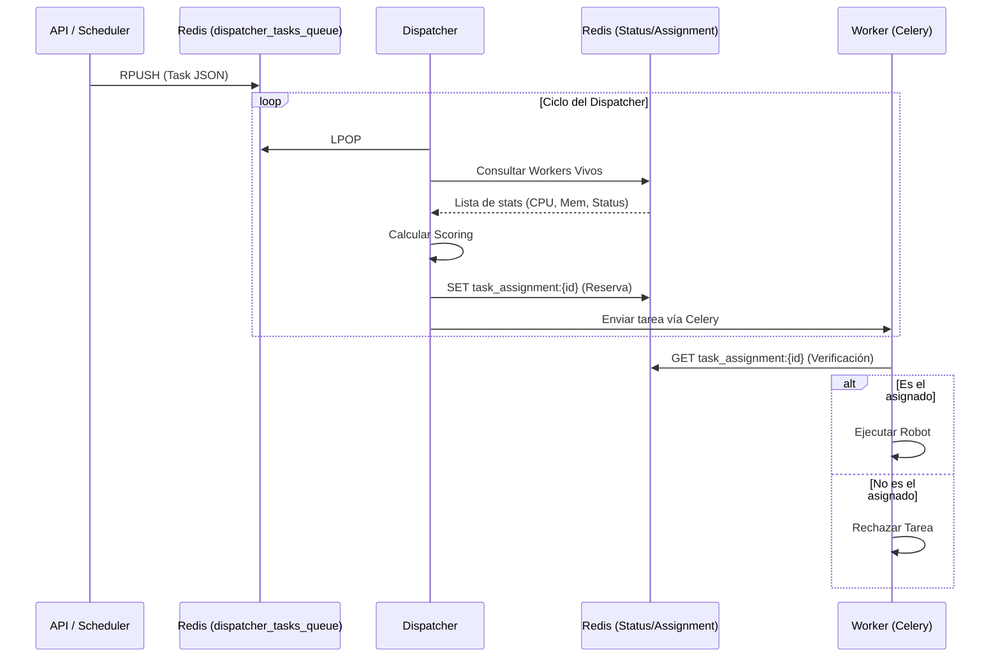

# Guía de Replicación del Dispatcher

Este documento detalla la arquitectura, el funcionamiento y la lógica del componente **Dispatcher** del proyecto RedTrust Automation, con el objetivo de permitir su recreación en cualquier otro stack tecnológico.

---

## 1. Arquitectura del Dispatcher Actual

El Dispatcher actúa como el orquestador inteligente del sistema. A diferencia de un sistema de colas simple donde los workers "tiran" de la carga, este sistema utiliza un modelo híbrido donde un componente central decide exactamente qué worker ejecutará qué tarea.

### Componentes clave:
1.  **Enqueuer (`api/enqueuer.py`)**: Punto de entrada. Valida que la tarea exista y la coloca en la "cola de entrada" primaria.
2.  **Dispatcher (`api/dispatcher.py`)**: El "cerebro". Monitorea la cola de entrada, el estado de los workers y toma decisiones de asignación.
3.  **Redis**: Actúa como bus de datos, almacén de estado (heartbeats) y sistema de mensajería para Celery.
4.  **Workers (`api/worker.py`)**: Ejecutores finales que reportan su salud y verifican sus asignaciones.

### Stack Tecnológico:
- **Lenguaje**: Python 3.x
- **Gestión de Tareas**: Celery
- **Base de Datos/Mensajería**: Redis
- **API**: FastAPI

---

## 2. Origen y Procesamiento de la Información

### Origen de los datos
Los datos provienen de:
- **Endpoints de la API**: Solicitudes externas para ejecutar robots.
- **Scheduler**: Tareas programadas que se disparan por tiempo.

### El Mensaje (Task Data)
Cuando se encola una tarea, se genera un objeto JSON con la siguiente estructura:
```json
{
  "task": "nombre_del_robot",
  "args": [],
  "kwargs": {"param1": "valor"},
  "timestamp": 1710000000.0,
  "enqueued_by": "api",
  "task_id": "uuid-opcional"
}
```

### Procesamiento Pre-envío
1.  **Validación**: El Enqueuer comprueba que el nombre del robot esté en el catálogo permitido.
2.  **Persistencia Temporal**: Se guarda en una lista de Redis llamada `dispatcher_tasks_queue` mediante una operación `RPUSH`.

---

## 3. Mecanismo de Comunicación y Envío

El Dispatcher utiliza un sistema de **"Push con Reserva"**.

### Monitoreo de Workers (Heartbeat)
Cada worker ejecuta un hilo secundario que publica cada 10 segundos en Redis:
- **Key**: `worker_status:{worker_id}` (con TTL de 30s).
- **Contenido**: CPU %, Memoria %, Estado (Free/Busy), IP, etc.

### Algoritmo de Selección (Scoring)
El Dispatcher recupera todos los workers que han enviado un heartbeat reciente y calcula una puntuación para cada uno:
- **CPU**: Menor uso = Mayor puntuación.
- **Memoria**: Mayor disponibilidad = Mayor puntuación.
- **Carga Reciente**: Se penaliza a los workers que han recibido tareas recientemente para balancear.

### El Protocolo de Asignación
Para evitar condiciones de carrera y asegurar que solo el worker elegido ejecute la tarea:
1.  El Dispatcher saca la tarea de la cola (`LPOP`).
2.  Selecciona al mejor worker.
3.  Escribe en Redis una "reserva": `task_assignment:{task_id}` -> `worker_id`.
4.  Envía la tarea real a través de Celery a la cola `robot_tasks`.
5.  **Validación en el Worker**: Al recibir la tarea, el worker consulta Redis. Si el `worker_id` en la reserva NO coincide con el suyo, rechaza la tarea inmediatamente (`Reject`).

---

## 4. Flujo Completo del Sistema



---

## 5. Reimplementación en otro Stack (Propuesta)

Si quisiéramos migrar este sistema a un stack basado en **Node.js** o **Go**, estas serían las directrices:

### Stack Sugerido: Node.js + RabbitMQ + Redis
- **Node.js**: Por su excelente manejo de I/O asíncrono para el Dispatcher.
- **RabbitMQ**: Reemplazando a Celery. Permite un ruteo más fino mediante *Exchanges* y *Routing Keys*.
- **Redis**: Manteniéndolo para el estado en tiempo real y heartbeats debido a su baja latencia.

### Piezas Conceptuales (Independientes de tecnología):
- **Catálogo de Tareas**: Definición clara de qué robots existen.
- **Monitor de Salud**: Sistema de heartbeats con TTL.
- **Lógica de Reserva**: El patrón "Reserva antes de Ejecutar" es vital para el control centralizado.

### Decisiones de Diseño:
1.  **Comunicación**: Usar WebSockets para reportar progreso desde el worker a la API en tiempo real.
2.  **Ruteo**: En lugar de que el Dispatcher envíe a una cola común, podría enviar directamente a una cola específica por worker (`robot_tasks.{worker_id}`). Esto eliminaría la necesidad de que el worker verifique la reserva en Redis.

---

## 6. Mejoras y Optimización

El sistema actual tiene algunas limitaciones que podrían mejorarse en una versión 2.0:

1.  **Doble Encolado (Overhead)**: La tarea pasa por Redis dos veces (primero como JSON simple, luego como mensaje de Celery).
    - *Mejora*: Usar ruteo directo a colas de worker específicas desde el Dispatcher.
2.  **Modelo de Polling**: El Dispatcher está en un loop constante.
    - *Mejora*: Usar el patrón `BRPOP` (blocking pop) o un sistema basado en eventos (Pub/Sub) para que el Dispatcher solo actúe cuando hay una tarea nueva.
3.  **Resiliencia**: Si el Dispatcher cae, las tareas se quedan en `dispatcher_tasks_queue` y nadie las procesa.
    - *Mejora*: Implementar Alta Disponibilidad (HA) para el Dispatcher con un modelo líder/seguidor.
4.  **Afinidad de Tareas**: Actualmente el scoring es genérico.
    - *Mejora*: Añadir "Capacidades" (Capabilities) a los workers (ej: "este worker tiene instalado Chrome", "este tiene acceso a RedTrust"). El Dispatcher filtraría workers por estas capacidades antes del scoring.
5.  **Control de Concurrencia**: El sistema actual marca al worker como "Busy" al iniciar.
    - *Mejora*: Permitir slots de ejecución basados en recursos disponibles (ej: un worker con 32GB de RAM podría ejecutar 4 robots simultáneos).

---

Este documento sirve como base técnica para cualquier equipo que necesite replicar la inteligencia de distribución de carga de este proyecto sin estar atado a Python o Celery.
